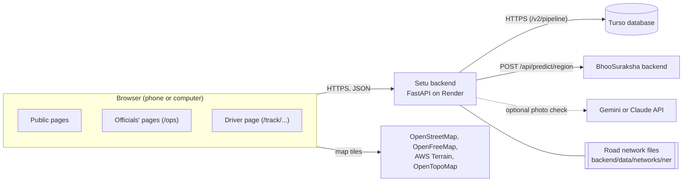
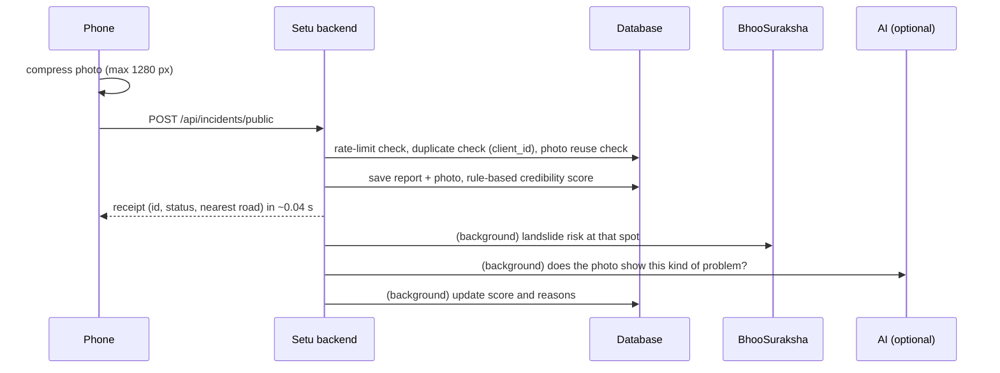

# 2. Architecture

## The parts



| Part | What it is | Where it runs |
|---|---|---|
| Website | React 19 + TypeScript single-page app, built with Vite 6, styled with Tailwind 4 | Vercel (static files) |
| Backend | FastAPI app, Python 3.12, served by Uvicorn | Render (free web service) |
| Road network | Pre-built files loaded into memory at startup (~17 MB on disk) | Inside the backend |
| Database | Turso (hosted SQLite) in production; a local SQLite file in development | Turso cloud / your computer |
| Landslide risk | BhooSuraksha's backend, called over HTTPS | Render (separate service) |
| AI photo check (optional) | Google Gemini or Anthropic Claude vision model | Their APIs |
| Base maps | Free tile services, no API keys | Third-party servers |

## Technology choices and why

| Choice | Why |
|---|---|
| **FastAPI** | Typed request validation (pydantic), automatic `/docs` page, fast enough for this load |
| **scipy sparse graphs** for routing | The region has 2,08,034 junctions and 2,77,986 road segments. networkx needed far more memory; scipy's Dijkstra on a sparse matrix fits in the free plan's 512 MB and answers a route in well under a second |
| **pyproj (UTM zone 46N, EPSG:32646)** + **cKDTree** | Accurate metre distances for snapping a clicked point to the nearest road junction |
| **pydantic-settings** | Every setting validated in one place (`config.py`); production refuses to start with an insecure secret |
| **Turso over plain HTTPS** | Persistent database on a free plan; the small client in `turso_http.py` uses Turso's documented HTTP API (the old WebSocket library is rejected by newer Turso databases) |
| **React + Vite + Tailwind** | Fast builds, one CSS theme file for the whole government-portal look |
| **Leaflet (2D) + MapLibre GL (3D)** | Both free and key-less; MapLibre adds terrain, hillshading and 3D buildings |
| **Render + Vercel + Turso free plans** | No credit card, no billing; enough for a prototype and demos |

## How a request flows

### Checking a route

1. The browser sends `POST /api/logistics/route` with an origin, a destination
   and, optionally, extra roads to treat as blocked.
2. The backend snaps both points to the nearest road junction (cKDTree in UTM
   metres).
3. It runs Dijkstra twice on the sparse graph: once on the normal network, once
   with blocked roads removed (blocked = roads in the database + the extra ones
   sent).
4. It returns one of four statuses:
   - `ok`: same route as normal
   - `rerouted`: a longer route exists, with the extra minutes
   - `unreachable`: no route left because of blockages
   - `no_data_link`: the two places aren't connected even in the normal data
     (a gap in the source data, not a blockage)
5. Typical time: 0.2–0.35 s for a route across states.

### Blocking a road

1. An official clicks a road on the map and picks a reason (Landslide, Flood,
   Bridge damage, Road collapse, Fallen tree, Accident, Construction, Other).
2. `POST /api/roads/blocked` saves it in the `road_blocks` table.
3. Every page that shows status reads `GET /api/roads/blocked`; the
   connectivity summary recomputes which villages, people and facilities lost
   their connection to the main network (about 0.03 s).
4. Active shipments whose route uses that road get a `cut_off` or `rerouted`
   alert the next time they are listed.

### A public report



If the phone has no connection, the report waits in the phone's offline queue
and is sent later with the same `client_id`. The reporter never waits for
BhooSuraksha or the AI: if either is slow or down, the report is already
saved.

### A driver's position

The driver's page calls `POST /api/track/{token}/ping` at most every 30
seconds, or sooner after moving 200 m. The backend stores the last position;
officials' shipment list computes ETA, delay and alerts from it.

## The BhooSuraksha link

`backend/risk_client.py` is the only place that calls BhooSuraksha.

| Behaviour | Setting | Default |
|---|---|---|
| Where to call | `BHOOSURAKSHA_API_URL` | empty = link off, risk card hidden |
| Timeout per call | `BHOOSURAKSHA_TIMEOUT_S` | 4 s |
| Cache answers per place per day | `RISK_CACHE_MINUTES` | 30 min |
| After a failure, stop calling for | `RISK_FAILURE_COOLDOWN_S` | 120 s |

- One pooled HTTPS connection (httpx) is reused.
- A failure is remembered, so a sleeping or broken BhooSuraksha costs one
  timeout, not one per request.
- When Setu's backend starts, it pings BhooSuraksha's `/health` once in the
  background, so a sleeping BhooSuraksha starts waking at the same time.
- `/ready` shows whether the link is configured, its last result and whether
  it is cooling down.

## Storage

| Data | Where |
|---|---|
| Officer accounts (`users`) | Database |
| Road blockages (`road_blocks`) | Database |
| Field reports (`incidents`) | Database |
| Report photos (`incident_photos`, base64) | Database, with a disk cache in `backend/data/uploads/` that is rebuilt on demand |
| Shipments and last driver position (`shipments`) | Database |
| Road network | Files in `backend/data/networks/ner/`, read-only |
| Offline report queue | The phone's browser storage (`localStorage`) |
| Login session | The browser's `localStorage` (a JWT) |

`db.py` and `auth.py` pick the database automatically: Turso when
`TURSO_DATABASE_URL` and `TURSO_AUTH_TOKEN` are set, otherwise a local SQLite
file under `backend/data/`. Photos live in the database because Render's free
plan wipes the server's disk whenever it sleeps.

## Performance

Measured on Python 3.12:

| | |
|---|---|
| Backend memory with the whole region loaded | ~360 MB (Render free plan limit: 512 MB) |
| Startup on a normal computer | ~5 s (much slower on Render's 0.1 CPU) |
| Route across states | 0.2–0.35 s |
| Cut-off impact for a set of blockages | ~0.03 s |
| Whole-region map (NH/SH/MDR roads) | 13.3 MB of JSON, 1.2 MB after GZip; built once (~1.5 s) then served from memory |
| One district's full road map (Dima Hasao) | 611 KB, 135 KB after GZip |

Every response carries a `Server-Timing` header, and requests slower than 1 s
are logged as "slow request".

## The wake-up call

Render's free plan puts the backend to sleep after 15 minutes without
traffic. The next visitor would wait about a minute and see errors. To handle
that:

1. Every page pings `GET /health` as soon as it opens
   (`frontend/src/utils/serverWake.ts`).
2. If the answer takes more than 3 s, a notice says *"Waking up the server…"*;
   it changes to *"Connected."* when the server answers.
3. All API calls wait for that ping instead of failing while the server boots.
4. After 90 s without an answer, the notice says the server can't be reached
   and offers *Try again*.
5. There is **no** repeating keep-alive timer, on purpose: two always-on
   services would use 1,440 hours a month, and Render's free plan gives 750.

## Repository layout

```
Setu/
├── backend/
│   ├── app.py              FastAPI app: startup, middleware, /health, /ready, login
│   ├── config.py           all settings (pydantic-settings), production checks
│   ├── auth.py             accounts, bcrypt passwords, JWT sessions
│   ├── create_admin.py     create an officer account / reset a password
│   ├── db.py               database helpers (SQLite or Turso)
│   ├── turso_http.py       minimal Turso client over HTTPS
│   ├── logistics.py        road network, routing, cut-off impact
│   ├── road_status.py      blocked roads, connectivity summary
│   ├── incidents.py        field reports, photos, review
│   ├── credibility.py      credibility score, optional AI photo check
│   ├── shipments.py        shipments, driver links, ETA, alerts
│   ├── risk_client.py      link to BhooSuraksha
│   ├── data/networks/ner/  the routable road network
│   ├── tests/              automated tests (pytest)
│   ├── requirements.txt    pinned runtime dependencies
│   └── requirements-dev.txt  + test dependencies
├── frontend/
│   ├── src/                pages, components, services, contexts
│   ├── vercel.json         build settings + send every path to index.html
│   └── package.json
├── docs/                   this documentation
├── render.yaml             Render Blueprint for the backend
└── .python-version         3.12
```

Details: [Backend](06-backend.md), [Frontend](07-frontend.md).
